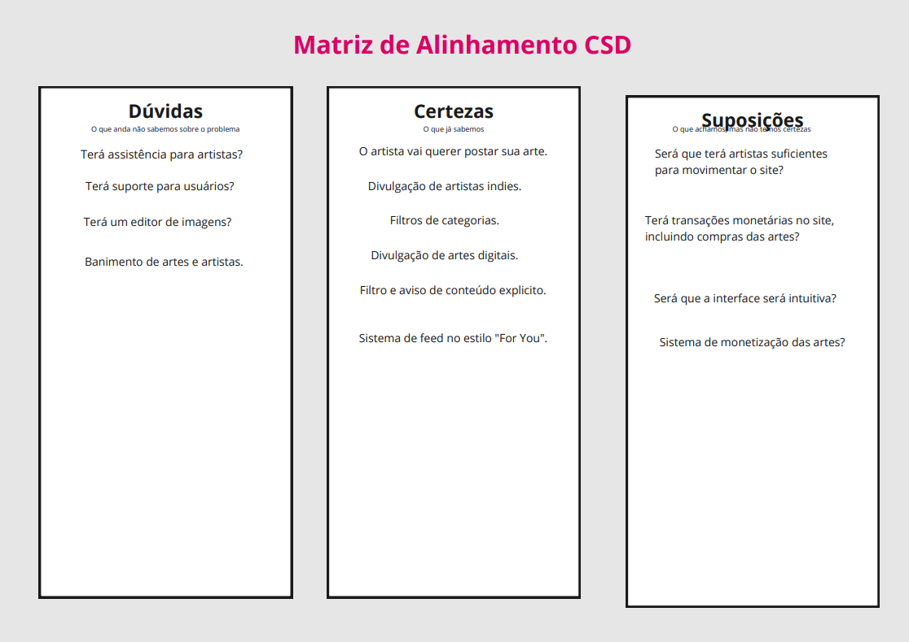
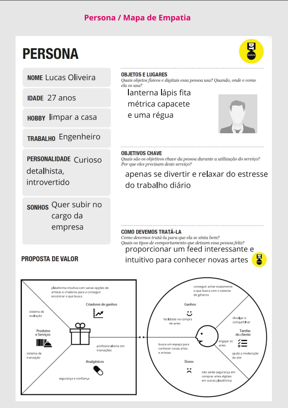
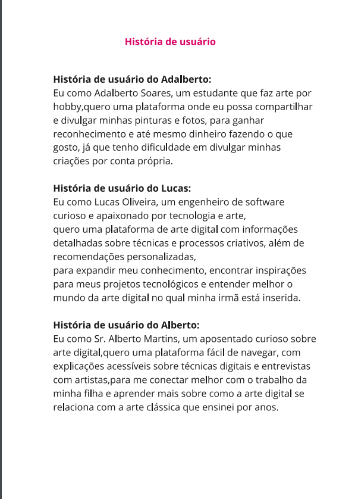
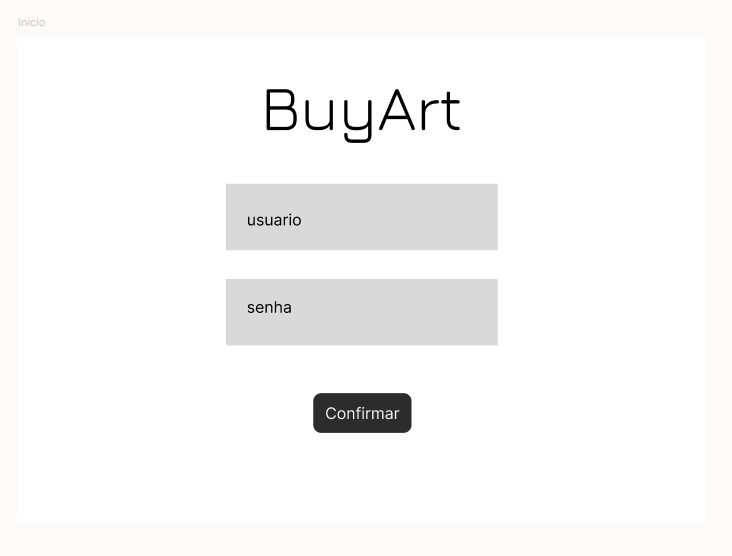
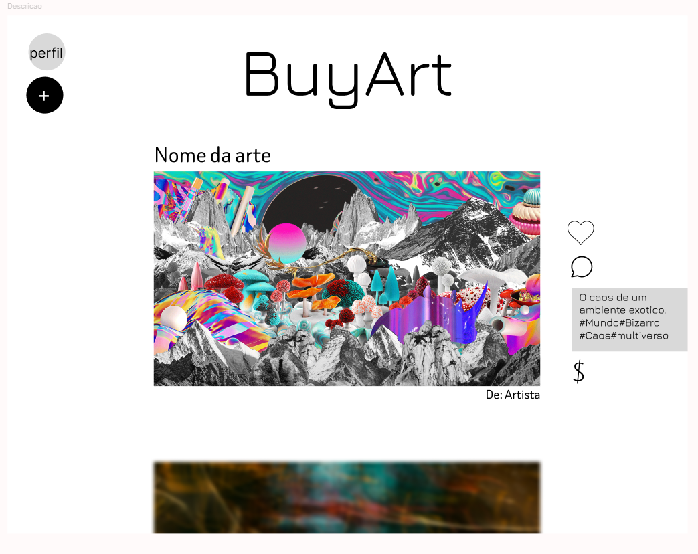
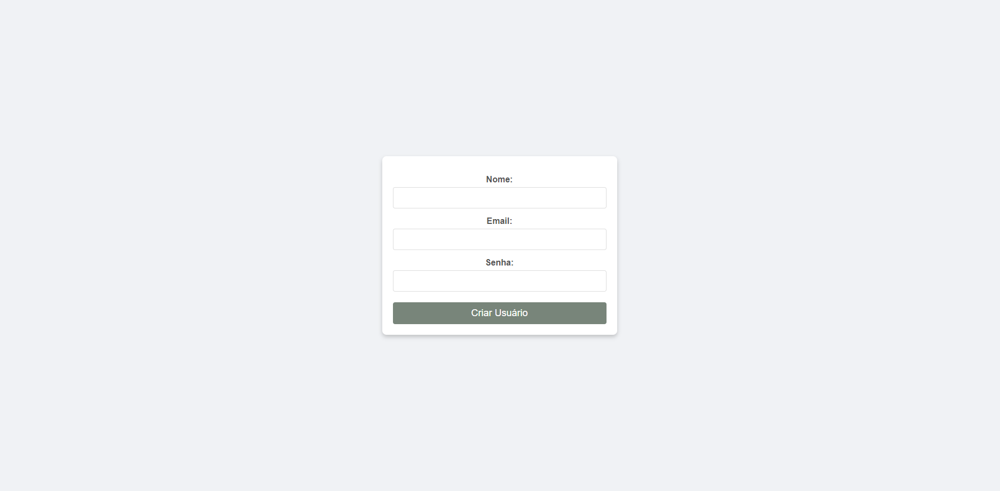
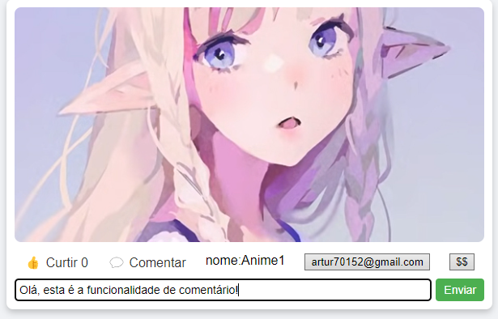
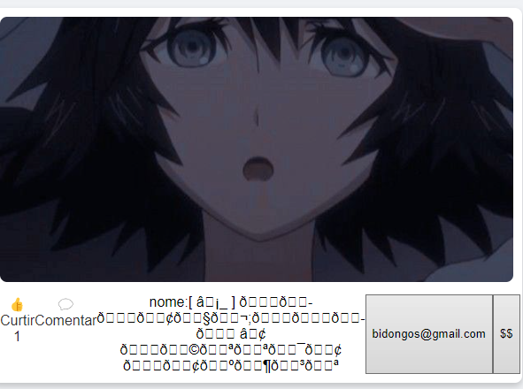
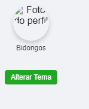

# Introdução

Informações básicas do projeto.

* **Projeto:** BuyArt  

* **Repositório GitHub:** [https://github.com/ICEI-PUC-Minas-CC-TI/pbh-cc-2024-2-ti1-ti-artes-digitais.git](https://github.com/ICEI-PUC-Minas-CC-TI/pbh-cc-2024-2-ti1-ti-artes-digitais.git)

* **Membros da equipe:**
  * [Raphael Grossi](https://github.com/HGonroy)
  * [Miguel Pessoa](https://github.com/MiguelPessoaLF)
  * [Gabriel Anderson](https://github.com/gonafritas)
  * [Artur Fernandes](https://github.com/artur70152)

A documentação do projeto é estruturada da seguinte forma:

1. Introdução  
2. Contexto  
3. Product Discovery  
4. Product Design  
5. Metodologia  
6. Solução  
7. Referências Bibliográficas

[Documentação de Design Thinking (MIRO)](files/ti_documentacao.pdf)

# Contexto

O BuyArt veio para revolucionar a forma como as pessoas compram e vendem arte. Com uma plataforma de compra e venda de arte digital, o BuyArt visa facilitar a conexão entre artistas e compradores por meio de uma plataforma visando ser uma rede social com sistema de feed e algumas outras features.

### Problema  

O BuyArt surge como uma solução para enfrentar a falta de visibilidade e valorização do trabalho de artistas na internet. Embora plataformas de compartilhamento de conteúdo tenham se multiplicado nos últimos anos, elas nem sempre oferecem ferramentas eficazes que conectem artistas diretamente a compradores ou apoiadores que reconheçam o valor de seu trabalho.  

Muitos artistas enfrentam desafios não apenas para alcançar seu público-alvo, mas também para transformar sua arte em uma fonte de renda sustentável. A saturação de conteúdo digital, a competitividade no mercado e a ausência de suporte especializado agravam essas dificuldades. Conforme apontado pelo estudo do Jornal *EXTRA CLASSE* (Simoneto e Lisboa, 2023), o mercado de arte digital continua a crescer, mas o desequilíbrio entre oferta e demanda, aliado à falta de plataformas que priorizem os interesses dos artistas, impede que muitos consigam monetizar adequadamente suas criações.  

Portanto, o BuyArt busca não apenas preencher essa lacuna, mas também criar um ambiente onde a criatividade seja amplamente reconhecida e valorizada, permitindo aos artistas estabelecer uma conexão direta e sustentável com seu público.

### Justificativa  

A criação do BuyArt é fundamentada pela necessidade de um ambiente que fortaleça a interação entre artistas e seu público, promovendo a valorização da economia criativa de forma acessível e sustentável. Observamos que, apesar do crescimento da arte digital e do mercado cultural, muitos artistas ainda encontram barreiras para se destacar, seja pela falta de ferramentas adequadas ou pela dificuldade de alcançar uma audiência disposta a apoiar financeiramente suas obras.  

O relatório *Creative Economy Report* (UNESCO, 2013) destaca que iniciativas voltadas à inclusão digital de artistas não apenas ampliam as possibilidades criativas, mas também geram impactos econômicos positivos, fomentando um mercado cultural mais dinâmico e diversificado. Inspirados por essa perspectiva, propomos uma solução que conecta criadores diretamente a consumidores, eliminando intermediários e reduzindo as barreiras de entrada para artistas independentes.  

A internet, com sua ampla capilaridade e influência sobre o comportamento dos consumidores, é a plataforma ideal para essa proposta. Ela oferece alcance global, permitindo que artistas de diferentes contextos e locais tenham as mesmas oportunidades de visibilidade. Além disso, a proposta busca transformar a relação entre arte e público, promovendo um consumo mais consciente e uma conexão significativa, onde o valor do trabalho artístico seja plenamente reconhecido.  

### Público-Alvo  

O público-alvo do BuyArt é diverso e abrange diferentes perfis que, direta ou indiretamente, se beneficiam de uma plataforma que promove a valorização da arte e a interação entre criadores e consumidores. Cada segmento tem suas próprias necessidades, expectativas e motivações, e o BuyArt está estruturado para atender a todas elas de forma integrada.  

- **Artistas:**  
  O principal grupo que o BuyArt busca atender são os artistas, sejam eles profissionais, freelancers, ou amadores, que desejam maior visibilidade para suas criações. Isso inclui pintores, ilustradores, designers gráficos, fotógrafos, escultores e criadores de arte digital, entre outros. Esses artistas geralmente enfrentam desafios relacionados à exposição de suas obras em um mercado saturado, bem como dificuldades em monetizar seus trabalhos de maneira justa. No BuyArt, eles encontrarão um ambiente dedicado ao compartilhamento de suas histórias, ao fortalecimento de sua presença online e à construção de uma base de fãs e clientes fiéis.  

- **Usuários interessados em arte:**  
  Esse segmento inclui colecionadores, decoradores, e consumidores que buscam adquirir obras de arte exclusivas ou peças personalizadas, seja para uso pessoal ou como presente. Esses usuários valorizam a originalidade, a conexão com os artistas e o apoio à economia criativa. Além de realizar compras, muitos também têm interesse em interagir com a comunidade artística, participar de eventos culturais online e explorar novos talentos.  

- **Empresas de jogos e design:**  
  Organizações nos setores de entretenimento, tecnologia e design também compõem um público estratégico para o BuyArt. Estúdios de jogos, empresas de publicidade, editoras e startups frequentemente buscam artistas para criar ilustrações, animações, designs conceituais e outros tipos de conteúdo personalizado. O BuyArt oferece a essas empresas um canal direto para encontrar e contratar talentos, simplificando o processo de seleção e garantindo qualidade e originalidade nas produções adquiridas.  

- **Entusiastas de tecnologia e cultura:**  
  Esse grupo é composto por indivíduos apaixonados por arte, tecnologia e inovação. São pessoas que gostam de descobrir novos talentos, apoiar causas relacionadas à cultura e fazer parte de comunidades criativas. Esses entusiastas valorizam o uso da tecnologia como ferramenta para conectar pessoas e impulsionar movimentos culturais. Além de consumir arte, muitos atuam como divulgadores de tendências e incentivadores de iniciativas que buscam democratizar o acesso à cultura e à economia criativa.  

- **Educadores e instituições de ensino artístico:**  
  Ainda que de forma secundária, o BuyArt também pode atender professores, mentores e instituições que promovem o ensino artístico. Esse público pode utilizar a plataforma como um recurso para mostrar o trabalho de seus alunos, encontrar referências criativas ou até mesmo como uma ponte para conectar aprendizes com o mercado.  

O BuyArt é, portanto, projetado para atender desde criadores que buscam reconhecimento até consumidores e empresas que enxergam na arte uma forma de enriquecer seus espaços, produtos e comunidades. A plataforma busca não só facilitar transações comerciais, mas também promover um ambiente onde arte e criatividade sejam celebradas e valorizadas em todas as suas formas.

# Product Discovery

## Etapa de Entendimento

* Matriz CSD  
* Mapa de stakeholders  
* Entrevistas qualitativas  
* Highlights de pesquisa  




## Etapa de Definição

### Personas





# Product Design

Essa fase envolve a definição de uma proposta de valor e a criação de wireframes, mockups e protótipos de alta fidelidade.

## Histórias de Usuários

| EU COMO...`PERSONA`  | QUERO/PRECISO ...`FUNCIONALIDADE`                        | PARA ...`MOTIVO/VALOR`                  |
|----------------------|--------------------------------------------------------|-----------------------------------------|
| Artista              | Desenhar e postar                                     | Lucrar com isso                         |
| Usuário do sistema   | Postar artes e fomentar a comunidade                  | Ser reconhecido e lucrar com isso       |
| Administrador        | Gerenciar e moderar a rede social BuyArt              | Manter a ordem e harmonia no site       |



## Proposta de Valor


## Requisitos

### Requisitos Funcionais

| ID     | Descrição do Requisito                                                    | Prioridade |
|--------|-----------------------------------------------------------------------------|------------|
| RF-001 | Permitir que o usuário acesse a rede social e navegue livremente em sua conta. | ALTA       |
| RF-002 | Possibilitar o envio de mensagens e comentários sobre as artes.               | MÉDIA      |
| RF-003 | Implementar funcionalidade de doação para os artistas.                       | ALTA       |
| RF-004 | Disponibilizar ferramentas de busca para encontrar artes e artistas.         | ALTA       |

### Requisitos Não Funcionais

| ID      | Descrição do Requisito                                             | Prioridade |
|---------|------------------------------------------------------------------|------------|
| RNF-001 | O sistema deve ser responsivo para rodar em dispositivos móveis.  | MÉDIA      |
| RNF-002 | Deve processar requisições do usuário em no máximo 3 segundos.        | BAIXA      |
| RNF-003 | Utilizar protocolos seguros para armazenamento e troca de dados. | ALTA       |
| RNF-004 | Garantir disponibilidade do sistema em 99% do tempo.             | ALTA       |

# Projeto de Interface

Artefatos relacionados à interface e interação do usuário.








## Protótipo Interativo

[Protótipo Interativo](https://www.figma.com/design/tIAitWKmroZEe3cb07LlNm/Raphael-Grossi's-team-library?node-id=0-1&t=9A7MVMKtCaBAggpd-1)


# Metodologia

Todos trabalharam construindo seus próprios artefatos e harmonizando para que o site funcionasse perfeitamente.

## Gerenciamento do Projeto

Utilizamos o modelo **Scrum** para organizar as entregas do projeto em sprints semanais. Cada membro da equipe ficou responsável por tarefas específicas definidas no backlog. As reuniões diárias (daily meetings) foram realizadas para alinhar o progresso e remover impedimentos. 

As principais ferramentas utilizadas foram:

- **Miro:** Para gestão do backlog e priorização das tarefas.
- **Google Drive:** Para compartilhamento de documentos e apresentações.
- **Discord:** Para comunicação síncrona entre os membros.

## Ferramentas

| Ambiente                    | Plataforma | Link de acesso                                     |
|-----------------------------|------------|--------------------------------------------------|
| Processo de Design Thinking | Miro       | [https://miro.com/app/board/uXjVL3cAQrQ=/?share_link_id=478612106930](https://miro.com/app/board/uXjVL3cAQrQ=/?share_link_id=478612106930) |
| Processo de Design Thinking | Miro       | [https://miro.com/app/board/uXjVKmJv9mY=/?share_link_id=822407940850](https://miro.com/app/board/uXjVKmJv9mY=/?share_link_id=822407940850) |
| Processo de Design Thinking | Miro       | [https://miro.com/app/board/uXjVKkYSgi4=/?share_link_id=870199955885](https://miro.com/app/board/uXjVKkYSgi4=/?share_link_id=870199955885) |
| Repositório de código       | GitHub     | [https://github.com/ICEI-PUC-Minas-CC-TI/pbh-cc-2024-2-ti1-ti-artes-digitais.git](https://github.com/ICEI-PUC-Minas-CC-TI/pbh-cc-2024-2-ti1-ti-artes-digitais.git) |
| Protótipo Interativo        | Figma      | [https://www.figma.com/design/tIAitWKmroZEe3cb07LlNm/Raphael-Grossi's-team-library?node-id=0-1&node-type=canvas&t=acsXNjZqIfqHriAk-0](https://www.figma.com/design/tIAitWKmroZEe3cb07LlNm/Raphael-Grossi's-team-library?node-id=0-1&node-type=canvas&t=acsXNjZqIfqHriAk-0) |

# Solução Implementada

## Vídeo do Projeto

[Vídeo do Projeto](https://youtu.be/QY9w4Jug6VM)


## Funcionalidades

Esta seção apresenta as funcionalidades da solução.

Funcionalidades incluem cadastro de contatos, postagem de imagens, doações, curtidas, busca, visualização de perfil e alteração de tema. Cada funcionalidade é acessada por meio do menu principal, permitindo a interação intuitiva com o sistema.

------------------------------------------------------------------------------------------------------------------------------------------------------------------------------------------------------------------
Funcionalidade 1 - Cadastro de Contatos

Permite a inclusão, leitura, alteração e exclusão de contatos para o sistema

Estrutura de dados: Contatos

Instruções de acesso:dd

Abra o site e efetue o login

Acesse o menu principal e escolha a opção Cadastros

Em seguida, escolha a opção Contatos

Tela da funcionalidade:



------------------------------------------------------------------------------------------------------------------------------------------------------------------------------------------------------------------

Funcionalidade 2 - Comentários

Permite a inclusão, leitura, alteração e exclusão de comentários para o sistema

Estrutura de dados: Comentários

Instruções de acesso:dd

Abra o site e efetue o login

Acesse o menu principal e clique no botão comentários

Em seguida, clique no botão enviar

Tela da funcionalidade:



------------------------------------------------------------------------------------------------------------------------------------------------------------------------------------------------------------------

Funcionalidade 3 - Postar Imagens

Permite a inclusão, leitura, alteração e exclusão de imagens para o sistema

Estrutura de dados: Imagens

Instruções de acesso:dd

Abra o site e efetue o logi

Acesse o menu principal e clique no perfil, depois clique em adicionar arte

Tela da funcionalidade:


------------------------------------------------------------------------------------------------------------------------------------------------------------------------------------------------------------------

Funcionalidade 4 - Doação

Perimite doação de valores e escrever uma mensagem para o artista

Estrutura de dados: Doações

Instruções de acesso:dd

Abra o site e efetue o login

Acesse o menu principal e clique no botão que tem $$ como símbolo

Tela da funcionalidade:



------------------------------------------------------------------------------------------------------------------------------------------------------------------------------------------------------------------

Funcionalidade 5 - Curtir

Permite curtir as imagens do sistema

Estrutura de dados: Curtidas

Instruções de acesso:dd

Abra o site e efetue o login

Acesse o menu principal e clique no perfil, depois clique em curtir

Tela da funcionalidade:


------------------------------------------------------------------------------------------------------------------------------------------------------------------------------------------------------------------

Funcionalidade 6 - Pesquisa

Permite a busca de imagens e artistas no sistema

Estrutura de dados: Busca

Instruções de acesso:dd

Abra o site e efetue o login

Acesse o menu principal e clique no campo de busca

Tela da funcionalidade:


------------------------------------------------------------------------------------------------------------------------------------------------------------------------------------------------------------------

Funcionalidade 7 - Perfil

Permite a visualização do perfil do usuário

Estrutura de dados: Perfil

Instruções de acesso:dd

Abra o site e efetue o login

Acesse o menu principal e clique no perfil localizado no canto superior esquerdo da tela

Tela da funcionalidade:



------------------------------------------------------------------------------------------------------------------------------------------------------------------------------------------------------------------

Funcionalidade 8 - Alterar Tema

Permite a alteração do tema do sistema

Estrutura de dados: Tema

Instruções de acesso:dd

Abra o site e efetue o login

Acesse o menu principal e clique no botão Alterar Tema localizado debaixo do perfil

Tela da funcionalidade:


# Estruturas de Dados

Descrição das estruturas de dados utilizadas na solução com exemplos no formato JSON.

### Estrutura de Dados - Login/Cadastro

```json
{
  "usuarios": [
    {
      "id": 1,
      "login": "ceo",
      "senha": "Uryu1973",
      "nome": "uryu",
      "email": "hutao@gmail.com"
    },
    {
      "id": 2,
      "login": "ichigo",
      "senha": "ichigo928",
      "nome": "User Ichigo",
      "email": "bleach@gmail.com"
    },
    {
      "id": 3,
      "login": "kenpachi",
      "senha": "katana",
      "nome": "Zaraki",
      "email": "konpaku@gmail.com"
    }
  ]
}
```

# Referências

EXTRA CLASSE. O impacto das redes no mercado das artes. 2023. Disponível em: [https://www.extraclasse.org.br/cultura/2023/07/o-impacto-das-redes-no-mercado-das-artes/](https://www.extraclasse.org.br/cultura/2023/07/o-impacto-das-redes-no-mercado-das-artes/). Acesso em: 15 dez. 2024.

OTIS COLLEGE OF ART AND DESIGN. Otis College of Art and Design. Disponível em: [https://www.otis.edu/index.html](https://www.otis.edu/index.html). Acesso em: 15 dez. 2024.

PINTEREST. Disponível em: [https://www.pinterest.com](https://www.pinterest.com). Acesso em: 15 dez. 2024.

INSTAGRAM. Disponível em: [https://www.instagram.com](https://www.instagram.com). Acesso em: 15 dez. 2024.

YOUTUBE. Disponível em: [https://www.youtube.com](https://www.youtube.com). Acesso em: 15 dez. 2024.

TIKTOK. Disponível em: [https://www.tiktok.com](https://www.tiktok.com). Acesso em: 15 dez. 2024.

ARTSTATION. Disponível em: [https://www.artstation.com](https://www.artstation.com). Acesso em: 15 dez. 2024.
